  
   
  

<h1 align="center">Hi 👋, I'm Phinixz Projects</h1>

  🚀 <b>Creative Game Developer & Fullstack Web Engineer</b> 
  Passionate about Unity, GTA V / SA-MP Modding, and 3D Visual Art.

<!-- Header Banner -->

---

## 🚀 Languages and Tools

### 🎮 Game Dev & 3D Art

  
  
  

### 💻 Programming Languages

  
  
  
  
  
  
  
  

### 🌐 Web & Mobile Development

  
  
  
  
  
  
  
  

---

## 📊 GitHub Stats

  
  

 

  

---

## ⚡️ Connect & Support

  
  &nbsp;
  

<!-- Footer Banner -->

